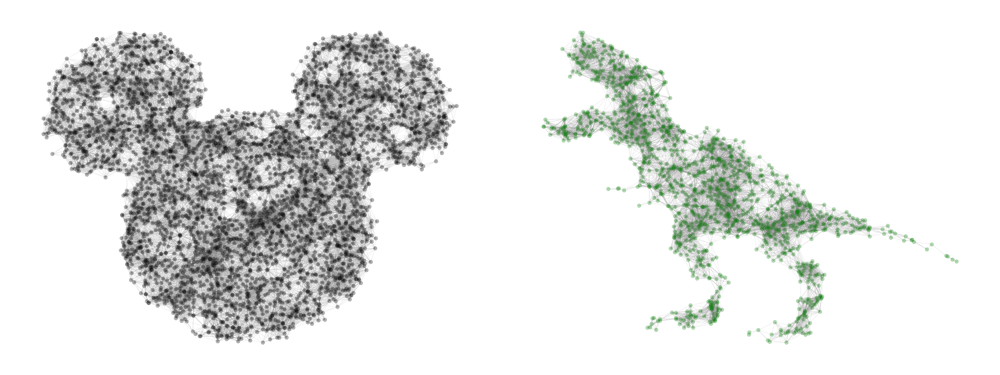

Hull Cover Conditioned Unit Disk Graph
========================================
[](https://codebeat.co/projects/github-com-benedekrozemberczki-hullcoverconditionedunitdiskgraph-master) [](https://github.com/benedekrozemberczki/HullCoverConditionedUnitDiskGraph/archive/master.zip)⠀[](https://twitter.com/intent/follow?screen_name=benrozemberczki)⠀

<p align="justify">
A generator for unit disk graphs conditioned on hull cover. The model first generates uniformly distributed points in 2 dimensions. Based on the input image points which are not covered with black (conditioning) are deleted from the initial set of points. Using the remaining point a fixed r-radius unit disk graph is grown. Finally, the edge list of the graph is saved with a large resolution plot of the graph.
  
</p>
<div style="text-align:center"></div>

### Requirements

The codebase is implemented in **Python 3.5.2.** package versions used for development are just below.
```
networkx          2.4
pandas            0.23.4
argparse          1.1.0
imageio           2.4.1
matplotlib        2.2.2
```
### Datasets
<p align="justify">
The code takes an input black and white jpeg file. Every pixel indicates whether the data point generated randomly is covered by black in the image or not. Points without a cover are dropped. The `/input/` folder contains a Mickey Mouse head, a T-rex and a flower as an example input image.
</p>


-------------------------------------------------------------


### Options

Learning of the embedding is handled by the `src/main.py` script which provides the following command line arguments.

#### Input and output options

```
  --input-path    STR     Input image path.         Default is `input/trex.jpg`.
  --output-image  STR     Output image path.        Default is `output/edges/trex_edges.csv`.
  --output-edges  STR     Edge list path.           Default is `output/plot/trex_graph.png`.
```

#### Model options

```
  --node-color     STR         Node coloring in plot.         Default is `green`. 
  --point-number   INT         Number of points in space.     Default is 10,000.
  --dpi            INT         DPI of plot.                   Default is 500.
  --radius         FLOAT       Radius for graph generation.   Default is 0.04.
  --line-width     FLOAT       Line width.                    Default is 0.2.
  --alpha          FLOAT       Alpha for color strength.      Default is 0.3.
  --node-size      FLOAT       Node size in plot.             Default is 12.0.  
```

--------------------------------------------------------------------------------


### Examples

The following commands learn a graph embedding and write the embedding to disk. The node representations are ordered by the ID.

Creating a random graph from the default T-rex image. 

```
python src/main.py
```

Creating an random graph from the `flower` image. The graph generation and plotting parameters are changed to create a high quality result.

```
python src/main.py --input-path input/flower.jpeg --output-image output/plot/flower.png --output-edges output/edges/flower.edges --node-color "red" --radius 0.07 --alpha 0.5
```
--------------------------------------------------------------------------------

**License**

- [GNU](https://github.com/benedekrozemberczki/HullCoverConditionedUnitDiskGraph/blob/master/LICENSE)

--------------------------------------------------------------------------------
